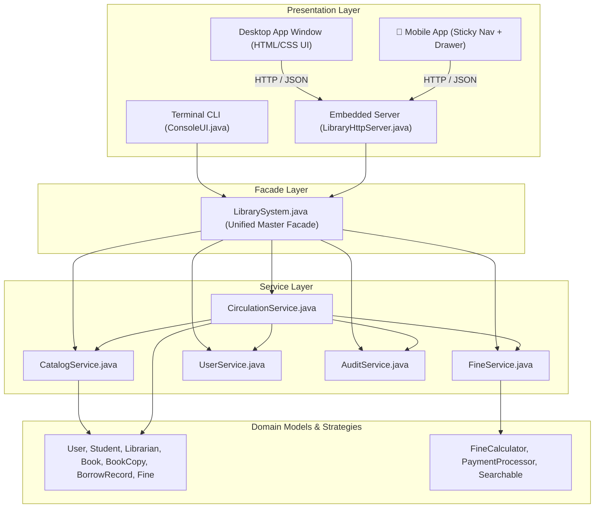
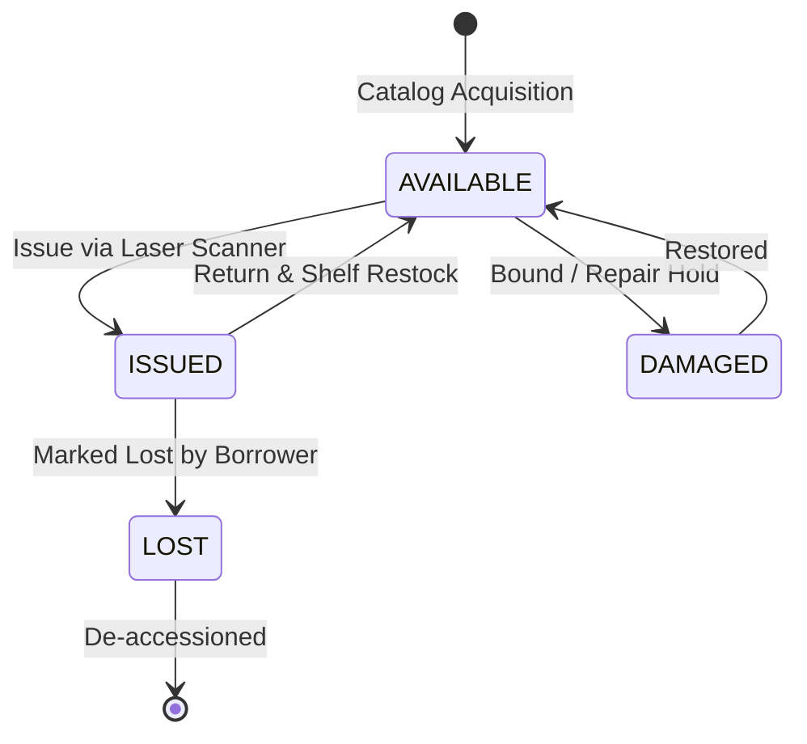
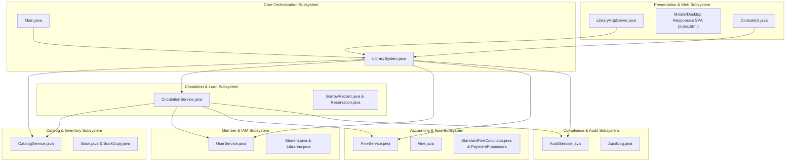

# 📖 College Library Management System: Complete OOP Tutorial & Architecture Guide

A comprehensive, textbook-style guide to the Object-Oriented Programming (OOP) principles, modular architecture (JPMS), design patterns, mobile responsiveness, and production engineering implemented in this Java application.

---

## 📑 Table of Contents
1. [Introduction to the Project](#1-introduction-to-the-project)
2. [High-Level Architecture](#2-high-level-architecture)
3. [The 4 Core Pillars of OOP in This Project](#3-the-4-core-pillars-of-oop-in-this-project)
   - [Pillar 1: Encapsulation](#pillar-1-encapsulation)
   - [Pillar 2: Inheritance](#pillar-2-inheritance)
   - [Pillar 3: Polymorphism](#pillar-3-polymorphism)
   - [Pillar 4: Abstraction](#pillar-4-abstraction)
4. [Software Design Patterns Applied](#4-software-design-patterns-applied)
   - [1. The Facade Pattern (`LibrarySystem.java`)](#1-the-facade-pattern-librarysystemjava)
   - [2. The Strategy Pattern (`FineCalculator` & `PaymentProcessor`)](#2-the-strategy-pattern-finecalculator--paymentprocessor)
   - [3. Separation of Concerns (Service Layer Architecture)](#3-separation-of-concerns-service-layer-architecture)
   - [4. The State Pattern & State Machines](#4-the-state-pattern--state-machines)
   - [5. The Observer / Audit Trail Pattern](#5-the-observer--audit-trail-pattern)
5. [Domain Model Deep Dive (The Classes)](#5-domain-model-deep-dive-the-classes)
   - [`Book` vs `BookCopy` (Physical vs Logical Entity)](#book-vs-bookcopy-physical-item-representation)
   - [User Hierarchy (`User`, `Student`, `Librarian`)](#user-hierarchy)
   - [Circulation Records & Penalties (`BorrowRecord`, `Fine`)](#circulation-records--penalties)
6. [The Java Platform Module System (JPMS) & Modular Architecture](#6-the-java-platform-module-system-jpms--modular-architecture)
   - [6.1 Why Modularity Matters in Modern Java](#61-why-modularity-matters-in-modern-java)
   - [6.2 The Project Module Descriptor (`module-info.java`)](#62-the-project-module-descriptor-module-infojava)
   - [6.3 Package-Level Modular Decomposition](#63-package-level-modular-decomposition)
   - [6.4 Functional Subsystems & Architectural Boundaries](#64-functional-subsystems--architectural-boundaries)
   - [6.5 Compiling Modular JARs & Linking Minimal Runtimes (`jlink`)](#65-compiling-modular-jars--linking-minimal-runtimes-jlink)
7. [Step-by-Step Data Flow: Borrowing a Book](#7-step-by-step-data-flow-borrowing-a-book)
8. [The Multi-Channel Presentation Layer](#8-the-multi-channel-presentation-layer)
   - [Terminal CLI (`ConsoleUI.java`)](#terminal-cli-consoleuijava)
   - [Embedded Web Desktop UI (`LibraryHttpServer.java`)](#embedded-web-desktop-ui-libraryhttpserverjava)
   - [RESTful JSON API Engine](#restful-json-api-engine)
9. [Self-Verifying Unit Tests (`TestRunner.java`)](#9-self-verifying-unit-tests-testrunnerjava)
10. [Mobile App Experience & Cross-Platform Responsive Architecture](#10-mobile-app-experience--cross-platform-responsive-architecture)
    - [10.1 The Mobile Viewport Challenge (`100vh` vs `100dvh`)](#101-the-mobile-viewport-challenge-100vh-vs-100dvh)
    - [10.2 Sticky Fixed Bottom Navigation Engine](#102-sticky-fixed-bottom-navigation-engine)
    - [10.3 Mobile Hamburger Menu (☰) & Slide-Over Navigation Drawer](#103-mobile-hamburger-menu--slide-over-navigation-drawer)
    - [10.4 Connecting Real Mobile Devices over Wi-Fi LAN](#104-connecting-real-mobile-devices-over-wi-fi-lan)
    - [10.5 Installing as a Standalone PWA App (iOS & Android)](#105-installing-as-a-standalone-pwa-app-ios--android)
11. [Production Deployment & Background Services](#11-production-deployment--background-services)
    - [11.1 Multi-Stage Docker Containerization (`Dockerfile`)](#111-multi-stage-docker-containerization-dockerfile)
    - [11.2 Orchestration with Docker Compose (`docker-compose.yml`)](#112-orchestration-with-docker-compose-docker-composeyml)
    - [11.3 Linux Systemd Daemon Service (`college-library.service`)](#113-linux-systemd-daemon-service-college-libraryservice)
    - [11.4 Cloudflare Zero Trust Tunnel for Global HTTPS](#114-cloudflare-zero-trust-tunnel-for-global-https)
    - [11.5 Application Runtime Modes (`--server`, `--headless`, `--cli`, `--test`)](#115-application-runtime-modes)
12. [How to Run, Build, and Extend](#12-how-to-run-build-and-extend)
13. [KTU B.Tech S3 Micro Project & Viva Guide](#13-ktu-btech-s3-micro-project--viva-guide)
    - [13.1 KTU CST 205 Syllabus Mapping](#131-ktu-cst-205-syllabus-mapping)
    - [13.2 Turnkey Project Report Reference (`PROJECT_REPORT.md`)](#132-turnkey-project-report-reference-project_reportmd)
    - [13.3 Top 15 External Viva Voce Questions & Answers](#133-top-15-external-viva-voce-questions--answers)

---

## 1. Introduction to the Project

The **College Library Management System (LMS)** is an enterprise-grade Java application designed to manage college circulation, inventory, member records, late fines, laser barcode scans, and administrative policies.

It was designed specifically to showcase **modern, clean Java OOP practices** (JDK 17/21):
- **Zero Heavy Dependencies**: Uses standard Java standard library (`java.time`, `java.util`, `com.sun.net.httpserver`, `java.desktop`).
- **Domain-Driven Design**: Real-world entities (`Book`, `Student`, `Librarian`, `Fine`) map directly to distinct, well-bounded Java classes.
- **Dual Presentation**: The same underlying Java core powers both an **interactive terminal CLI**, a **native desktop window UI**, and a **mobile-optimized responsive web app**.
- **Java Platform Module System (JPMS)**: Strict encapsulation using `module-info.java`.

---

## 2. High-Level Architecture

The project adheres to a standard **Layered Architecture**:



---

## 3. The 4 Core Pillars of OOP in This Project

### Pillar 1: Encapsulation

**Encapsulation** means bundling data (attributes) and behavior (methods) into a single class, keeping internal state `private` or `protected`, and exposing only controlled methods.

#### Real Code Example: [`Student.java`](file:///Users/abinpramodb/Downloads/library/java-lms/src/com/library/models/Student.java)
```java
public class Student extends User {
    private String registerNumber;
    private String semester;
    private double outstandingFine;       // Private! External code cannot directly overwrite
    private int currentBorrowedCount;     // Controlled mutation only

    // Controlled mutation: Prevents negative fines
    public void addFine(double amount) {
        if (amount > 0) {
            this.outstandingFine += amount;
        }
    }

    public void deductFine(double amount) {
        if (amount > 0 && amount <= this.outstandingFine) {
            this.outstandingFine -= amount;
        }
    }
}
```

*Why it matters*: By protecting `outstandingFine`, other developers or rogue UI scripts cannot accidentally set a student's balance to negative values or erase debts without recording a proper payment transaction.

---

### Pillar 2: Inheritance

**Inheritance** allows specialized subclasses to inherit common properties and methods from a shared parent class, eliminating duplicated code and establishing an **IS-A** relationship.

#### Class Hierarchy:
```
           ┌──────────────┐
           │     User     │  (id, name, email, phone, role)
           └──────▲───────┘
                  │
        ┌─────────┴─────────┐
        │                   │
┌───────┴──────┐    ┌───────┴───────┐
│   Student    │    │   Librarian   │
└──────────────┘    └───────────────┘
 (registerNo,        (employeeId,
  semester,           shift,
  quota = 4)          deskNumber)
```

#### Real Code Example: [`User.java`](file:///Users/abinpramodb/Downloads/library/java-lms/src/com/library/models/User.java)
```java
public abstract class User {
    protected String id;
    protected String name;
    protected String email;
    protected Role role;

    public abstract int getMaxBorrowQuota();
    public abstract int getLoanPeriodDays();
}
```

`Student` and `Librarian` both inherit from `User`. They inherit fields like `id`, `name`, and `email`, but implement their own specific borrow rules:

```java
// Student: Maximum 4 books, 14-day borrowing duration
@Override
public int getMaxBorrowQuota() { return 4; }

@Override
public int getLoanPeriodDays() { return 14; }
```

```java
// Librarian: Unlimited internal borrowing (e.g. 50 books), 60-day loan period
@Override
public int getMaxBorrowQuota() { return 50; }

@Override
public int getLoanPeriodDays() { return 60; }
```

---

### Pillar 3: Polymorphism

**Polymorphism** ("many shapes") allows code to treat different subclass objects through a common superclass or interface reference, while executing each subclass's specific behavior at runtime.

#### 1. Method Overriding (Dynamic Polymorphism)
When `CirculationService` checks if a borrower can check out another book, it does not write messy `if (user instanceof Student) ... else if (user instanceof Librarian)` checks:

```java
public boolean canBorrow(User user) {
    // Dynamically invokes Student.getMaxBorrowQuota() or Librarian.getMaxBorrowQuota()
    return user.getCurrentBorrowedCount() < user.getMaxBorrowQuota();
}
```
If you introduce a `Faculty` user class tomorrow with a quota of 10, **`CirculationService` requires zero changes**!

#### 2. Method Overloading (Compile-Time Polymorphism)
In [`CatalogService.java`](file:///Users/abinpramodb/Downloads/library/java-lms/src/com/library/services/CatalogService.java):
```java
// Search by general keyword across title, author, and category
public List<Book> search(String keyword) { ... }

// Search specifically by unique ISBN
public Optional<Book> search(String isbn, boolean exactMatch) { ... }
```

---

### Pillar 4: Abstraction

**Abstraction** hides complex implementation details and exposes only an intuitive interface to callers.

#### Real Code Example: [`Searchable.java`](file:///Users/abinpramodb/Downloads/library/java-lms/src/com/library/interfaces/Searchable.java)
```java
public interface Searchable {
    boolean matches(String query);
}
```
Both `Book` and `Student` implement `Searchable`. The search engine doesn't care whether an item is a paper book, an electronic copy, or a human student—it only cares that the object knows how to evaluate `matches(query)`.

```java
// In Book.java:
@Override
public boolean matches(String query) {
    String q = query.toLowerCase();
    return title.toLowerCase().contains(q) || author.toLowerCase().contains(q) || isbn.contains(q);
}

// In Student.java:
@Override
public boolean matches(String query) {
    String q = query.toLowerCase();
    return name.toLowerCase().contains(q) || registerNumber.toLowerCase().contains(q);
}
```

---

## 4. Software Design Patterns Applied

### 1. The Facade Pattern ([`LibrarySystem.java`](file:///Users/abinpramodb/Downloads/library/java-lms/src/com/library/LibrarySystem.java))

A library contains multiple interconnected subsystems: `CatalogService`, `CirculationService`, `FineService`, `UserService`, and `AuditService`. If the UI or CLI had to talk to each service directly, UI code would become hopelessly tangled.

The **Facade Pattern** provides a single, high-level gateway:

```
[UI / Terminal CLI / REST Server]
              │
              ▼ (Calls simple 1-line facade methods)
     [LibrarySystem.java]
       ├──> CatalogService
       ├──> CirculationService
       ├──> FineService
       ├──> UserService
       └──> AuditService
```

```java
// The UI makes one simple call:
librarySystem.issueBook(studentId, barcode, operatorName);

// Under the hood, the Facade orchestrates 4 different services:
// 1. Validates user status with UserService
// 2. Checks out physical copy via CatalogService
// 3. Generates loan record via CirculationService
// 4. Writes security log via AuditService
```

---

### 2. The Strategy Pattern (`FineCalculator` & `PaymentProcessor`)

The **Strategy Pattern** defines a family of algorithms, encapsulates each one, and makes them interchangeable at runtime.

#### A. Fine Calculation Strategy
```
          ┌──────────────────────────┐
          │  <<FineCalculator>>      │
          ├──────────────────────────┤
          │ + calculateFine(days)    │
          └────────────▲─────────────┘
                       │
       ┌───────────────┴───────────────┐
       │                               │
┌──────┴────────────────────┐   ┌──────┴─────────────────────┐
│  StandardFineCalculator   │   │   HolidayFineCalculator    │
│  (₹2.00 / day overdue)    │   │  (Excludes Sundays & breaks)
└───────────────────────────┘   └────────────────────────────┘
```

```java
public interface FineCalculator {
    double calculateFine(long overdueDays, double dailyRate);
}
```

#### B. Payment Processing Strategy
Different payment providers (Cash at desk, UPI QR scan, Credit Card) have different processing logic:
```java
public interface PaymentProcessor {
    boolean processPayment(double amount, String reference);
}
```
When a student pays a fine, `FineService` uses the selected processor without altering any fine tracking logic!

---

### 3. Separation of Concerns (Service Layer Architecture)

Each service class has **one clear responsibility**:
| Service | Responsibility |
| :--- | :--- |
| [`CatalogService`](file:///Users/abinpramodb/Downloads/library/java-lms/src/com/library/services/CatalogService.java) | Book creation, physical copy generation, title/author search. |
| [`CirculationService`](file:///Users/abinpramodb/Downloads/library/java-lms/src/com/library/services/CirculationService.java) | Borrowing rules, issue timestamps, return handling, renewals. |
| [`FineService`](file:///Users/abinpramodb/Downloads/library/java-lms/src/com/library/services/FineService.java) | Overdue penalty calculation, invoice tracking, payment clearing. |
| [`UserService`](file:///Users/abinpramodb/Downloads/library/java-lms/src/com/library/services/UserService.java) | Member directories, registration, credential lookup. |
| [`AuditService`](file:///Users/abinpramodb/Downloads/library/java-lms/src/com/library/services/AuditService.java) | Immutable audit log of all system transactions. |

---

### 4. The State Pattern & State Machines

Physical library copies transition between explicit, validated lifecycle states governed by [`BookStatus.java`](file:///Users/abinpramodb/Downloads/library/java-lms/src/com/library/enums/BookStatus.java):



---

### 5. The Observer / Audit Trail Pattern

Every security-sensitive operation (book checked out, overdue penalty waived, administrative rule adjusted) is tracked via [`AuditService.java`](file:///Users/abinpramodb/Downloads/library/java-lms/src/com/library/services/AuditService.java). This creates an immutable chronological audit trail for accreditation inspections.

---

## 5. Domain Model Deep Dive (The Classes)

### `Book` vs `BookCopy` (Physical Item Representation)
A common beginner mistake is equating a title to a physical copy:
- *“Clean Code by Robert C. Martin”* is a **Book** (has an ISBN, author, category).
- The library owns **3 physical copies** of this book on Shelf `CS-02`. Each copy has its own unique barcode (`BC-CS-001-C1`, `BC-CS-001-C2`, `BC-CS-001-C3`) and its own condition and status (`AVAILABLE`, `ISSUED`, `LOST`).

This is modeled cleanly using **Composition**:
```java
public class Book {
    private int id;
    private String title;
    private String author;
    private String isbn;
    private final List<BookCopy> copies; // A Book HAS-A collection of BookCopies

    public void addCopy(BookCopy copy) {
        copies.add(copy);
        recalcAvailable();
    }
}
```

---

## 6. The Java Platform Module System (JPMS) & Modular Architecture

### 6.1 Why Modularity Matters in Modern Java

Prior to Java 9, Java used a flat classpath model. Any class could access public methods of any other class on the classpath, leading to:
- **Classpath Hell**: Silent version conflicts and missing dependency crashes at runtime.
- **Leaky Abstractions**: Internal implementation classes could not be truly hidden from external consumers.
- **Bloated Runtimes**: Every Java deployment had to ship the entire monolithic JRE (hundreds of megabytes).

With the **Java Platform Module System (JPMS)** (JSR 376), Java introduced strong encapsulation, explicit dependency graphs, and modular linking via `jlink`.

---

### 6.2 The Project Module Descriptor (`module-info.java`)

Located at [`java-lms/src/module-info.java`](file:///Users/abinpramodb/Downloads/library/java-lms/src/module-info.java), this file declares the application module:

```java
module com.library {
    // 1. Explicit platform module dependencies
    requires java.base;       // Core language runtime (collections, time, concurrency)
    requires java.desktop;    // For Desktop.getDesktop().browse() browser launcher
    requires jdk.httpserver;  // Built-in lightweight HTTP & REST server

    // 2. Explicit public package exports (API Boundary)
    exports com.library;
    exports com.library.enums;
    exports com.library.interfaces;
    exports com.library.models;
    exports com.library.services;
    exports com.library.strategies;
    exports com.library.ui;
}
```

#### Key Directives Explained:
1. `requires <module>`: Declares that our module depends on another module. The Java runtime verifies all required modules exist *at startup*, preventing missing library errors during operation.
2. `exports <package>`: Exposes public types inside that package to consumers. Any package NOT listed in `exports` is strictly private to this module—even if its classes are declared `public`!
3. `opens <package>`: Allows reflective access (e.g. for JSON serializers or DI frameworks).

---

### 6.3 Package-Level Modular Decomposition

The project organizes code into cleanly bounded packages:

```
java-lms/src/
├── module-info.java            <-- Module Descriptor
└── com/library/
    ├── Main.java               <-- CLI & GUI Bootstrap
    ├── LibrarySystem.java      <-- Master Facade
    ├── LibraryHttpServer.java  <-- Embedded Server & REST Handlers
    ├── enums/                  <-- Type Safety (Role, BookStatus, PaymentMethod)
    ├── interfaces/             <-- Abstractions (Searchable)
    ├── models/                 <-- Entities (Book, Student, BorrowRecord, Fine)
    ├── services/               <-- Business Logic (Catalog, Circulation, Fine)
    ├── strategies/             <-- Behavioral Policies (FineCalculator, PaymentProcessor)
    └── ui/                     <-- CLI (ConsoleUI) & Tests (TestRunner)
```

---

### 6.4 Functional Subsystems & Architectural Boundaries

From a system architecture standpoint, the application is divided into **7 High-Cohesion Subsystems**:



---

### 6.5 Compiling Modular JARs & Linking Minimal Runtimes (`jlink`)

#### 1. Compiling with Module Path:
```bash
# Compile modular source code into bin directory
javac -d bin -sourcepath src $(find src -name "*.java")
```

#### 2. Packaging as a Modular Executable JAR:
```bash
jar --create --file LibraryManagementSystem.jar \
    --main-class com.library.Main \
    -C bin .
```

#### 3. Inspecting Module Info from the Compiled JAR:
```bash
jar --describe-module --file LibraryManagementSystem.jar
```
*Output*:
```text
com.library jar:file:.../LibraryManagementSystem.jar/!module-info.class
exports com.library
exports com.library.enums
exports com.library.interfaces
exports com.library.models
exports com.library.services
exports com.library.strategies
exports com.library.ui
requires java.base
requires java.desktop
requires jdk.httpserver
```

#### 4. Assembling a Custom JRE with `jlink` (Shrinking JDK from 300MB to ~35MB):
Because our application declares its exact dependencies in `module-info.java`, `jlink` can strip away unused parts of the JDK (like Swing, CORBA, SQL, XML) and bundle only what is required:
```bash
jlink --module-path $JAVA_HOME/jmods:LibraryManagementSystem.jar \
      --add-modules com.library \
      --launcher library-app=com.library/com.library.Main \
      --output custom-runtime \
      --strip-debug \
      --compress 2 \
      --no-header-files \
      --no-man-pages
```
The resulting `custom-runtime/` folder contains a standalone self-executing bundle that runs without requiring Java to be installed on the client machine!

---

## 7. Step-by-Step Data Flow: Borrowing a Book

Here is what happens inside the JVM when a student checks out a book:

```
Step 1: Invocation
   UI/CLI calls: librarySystem.issueBook("STU-2024-0042", "BC-CS-001-C1", "Librarian #102")

Step 2: User Validation (CirculationService)
   userService.getStudentById("STU-2024-0042")
   Checks:
   ✔ Is student active?
   ✔ Has student borrowed fewer than 4 books?
   ✔ Is outstanding fine < ₹100.00?

Step 3: Inventory Validation (CatalogService)
   catalogService.getCopyByBarcode("BC-CS-001-C1")
   Checks:
   ✔ Does copy exist?
   ✔ Is copy status AVAILABLE?

Step 4: Transaction Execution
   • Mark copy status = ISSUED
   • Decrement available count on Book parent
   • Increment currentBorrowedCount on Student
   • Create new BorrowRecord (IssueDate = Today, DueDate = Today + 14 days)

Step 5: Audit Logging
   auditService.logAction("Librarian #102", "BOOK_ISSUED", "Issued 'Clean Code' to Student")

Step 6: Return Result
   Return BorrowRecord object to the caller to display confirmation.
```

---

## 8. The Multi-Channel Presentation Layer

One of the strengths of this design is that **business logic is completely independent of the user interface**:

```
                  ┌──────────────────────┐
                  │  LibrarySystem.java  │
                  └──────────▲───────────┘
                             │
            ┌────────────────┼────────────────┐
            │                │                │
 ┌──────────┴──────────┐     │     ┌──────────┴──────────┐
 │  ConsoleUI.java     │     │     │ LibraryHttpServer   │
 │  (Pure ANSI CLI)    │     │     │ (Embedded Engine)   │
 └─────────────────────┘     │     └──────────┬──────────┘
                             │                │
                             │       ┌────────┴────────┐
                             │       │                 │
                             │   Desktop Window   Mobile Browser
                             │   (Chrome App)     (Phone Safari)
```

### Terminal CLI ([`ConsoleUI.java`](file:///Users/abinpramodb/Downloads/library/java-lms/src/com/library/ui/ConsoleUI.java))
- Ideal for headless servers, quick debugging, or automated scripts.
- Run via: `java -jar LibraryManagementSystem.jar --cli`

### Embedded Web Desktop UI ([`LibraryHttpServer.java`](file:///Users/abinpramodb/Downloads/library/java-lms/src/com/library/LibraryHttpServer.java))
- Uses Java's lightweight built-in HTTP server (`com.sun.net.httpserver.HttpServer`).
- Serves the encapsulated single-page UI from inside the JAR.
- Automatically launches a clean desktop window.
- Run via: `./College` or `./run_java.sh`

### RESTful JSON API Engine
The embedded server exposes a clean REST API consumable by web, mobile, or external systems:
- `GET /api/books`: Full catalog inventory with shelf locations.
- `POST /api/issue`: Issue book by student ID and barcode.
- `POST /api/return`: Return book by barcode and calculate fines.
- `POST /api/fines`: Pay overdue fines via UPI or card.
- `GET /api/stats`: Dashboard KPIs (active loans, fine totals, inventory counts).

---

## 9. Self-Verifying Unit Tests ([`TestRunner.java`](file:///Users/abinpramodb/Downloads/library/java-lms/src/com/library/ui/TestRunner.java))

The project includes an in-memory test runner that verifies core OOP mechanics without requiring external testing frameworks:

1. **Test 1: Catalog Service & Book Copy Generation**
   Verifies that adding a book creates the requested number of unique barcodes.
2. **Test 2: Student Max Borrow Quota Enforcement**
   Verifies that a student cannot borrow more than their allowed limit (`getMaxBorrowQuota()`).
3. **Test 3: Overdue Fine Calculation Strategy**
   Verifies that the `StandardFineCalculator` correctly calculates `days * dailyRate`.
4. **Test 4: Fine Payment Deduction**
   Verifies that paying a fine decreases outstanding balance and prevents negative balances.
5. **Test 5: Book Return & Availability Recalculation**
   Verifies that returning a book immediately updates the copy's status back to `AVAILABLE`.

Run tests anytime with:
```bash
java -jar LibraryManagementSystem.jar --test
```

---

## 10. Mobile App Experience & Cross-Platform Responsive Architecture

The application includes an enterprise-grade mobile web application that runs directly from smartphones (iOS Safari, Android Chrome) connected to the library network.

```
┌─────────────────────────────────┐       ┌─────────────────────────────────┐
│        🖥️ Desktop Mode          │       │         📱 Mobile Mode          │
├──────────────┬──────────────────┤       ├─────────────────────────────────┤
│ Left Sidebar │ Content Canvas   │       │ Header: [Logo] [Role] [☰ Menu]  │
│ • Home       │ • Wide Tables    │       ├─────────────────────────────────┤
│ • Catalog    │ • Multi-column   │       │ Single Column Scrollable Feed   │
│ • My Books   │   Metric Cards   │       │ (Cards, Large Touch Targets)    │
│ • Fines      │ • Floating Modals│       ├─────────────────────────────────┤
│ • Profile    │                  │       │ Sticky Fixed Bottom Bar         │
│              │                  │       │ [Home] [Catalog] [Books] [Pass] │
└──────────────┴──────────────────┘       └─────────────────────────────────┘
```

---

### 10.1 The Mobile Viewport Challenge (`100vh` vs `100dvh`)

A critical bug in traditional web apps on mobile browsers is the **Viewport Address Bar Trap**:
- On iOS Safari and Android Chrome, the URL bar expands and collapses dynamically as the user interacts with the page.
- CSS `height: 100vh` calculates height *without* considering the bottom toolbar. This pushes the bottom navigation menu 60–80px below the visible screen edge.
- When combined with `body { overflow: hidden; }`, the bottom navigation menu becomes **completely invisible and unscrollable**.

#### The Fix:
We resolved this using CSS **Dynamic Viewport Height** (`100dvh`) combined with **Safe Area Insets**:

```css
html {
  height: 100%;
}
body {
  height: 100%;
  height: 100vh;
  height: 100dvh; /* Adapts dynamically to browser chrome */
  overflow: hidden;
  -webkit-tap-highlight-color: transparent;
}
```

---

### 10.2 Sticky Fixed Bottom Navigation Engine

On screens `<= 767px`, navigation is docked to the physical bottom of the phone screen using `position: fixed` with glassmorphism blur and home-indicator padding:

```css
@media (max-width: 767px) {
  .bottom-nav {
    position: fixed !important;
    bottom: 0 !important;
    left: 0 !important;
    right: 0 !important;
    width: 100% !important;
    background: rgba(255, 255, 255, 0.98) !important;
    backdrop-filter: blur(16px) !important;
    -webkit-backdrop-filter: blur(16px) !important;
    border-top: 1px solid var(--slate-200) !important;
    box-shadow: 0 -4px 16px rgba(15, 23, 42, 0.08) !important;
    z-index: 9999 !important;
    padding-bottom: max(10px, env(safe-area-inset-bottom, 12px)) !important;
    padding-top: 4px !important;
  }
}
```

---

### 10.3 Mobile Hamburger Menu (☰) & Slide-Over Navigation Drawer

In addition to bottom tabs, mobile users have access to a top **☰ Menu** button that opens a slide-over navigation drawer:

1. **User Identity Card**: Displays the student's avatar, name, and register number (`2026CE045 · CSE`) or staff badge.
2. **Instant Portal Switcher**: Tap to switch between 📱 **Student**, 📷 **Librarian**, and ⚙️ **Admin** consoles directly.
3. **Full Page Navigation**: All catalog, search, circulation, and reporting pages.
4. **Quick Action Shortcuts**:
   - 📦 View Stacks Shelf Inventory
   - 🪪 Digital Library Pass
   - 💰 Outstanding Fines & UPI Settlement
   - ⚡ Laser Barcode Scanner

---

### 10.4 Connecting Real Mobile Devices over Wi-Fi LAN

To open and test the library application on any phone or tablet on the same Wi-Fi network:

1. **Find your computer's local Wi-Fi IP address**:
   ```bash
   # On macOS:
   ipconfig getifaddr en0
   # (e.g. 192.168.220.22)
   ```

2. **Open the browser on your phone** and navigate to:
   ```text
   http://192.168.220.22:8080/
   ```

3. **Troubleshooting Phone Connection**:
   - Ensure your phone is on the **same Wi-Fi network** as the host computer.
   - If the page does not load, verify that macOS Firewall is not blocking incoming connections on port 8080 (*System Settings ➔ Network ➔ Firewall*).
   - Ensure the server was started with host `0.0.0.0` (as in Docker Compose) rather than strictly `127.0.0.1`.

---

### 10.5 Installing as a Standalone PWA App (iOS & Android)

The app includes an embedded **Web App Manifest**:
1. Open the URL in Safari on iPhone or Chrome on Android.
2. Tap the browser **Share** button (iOS) or **Three Dots ⋮** (Android).
3. Select **Add to Home Screen**.
4. The College Library app now launches full-screen with an app icon, standalone title bar, and native haptic feedback!

---

## 11. Production Deployment & Background Services

For 24/7 continuous operation in university computer centers or cloud VPS servers, the project provides containerized and native Linux service configurations.

### 11.1 Multi-Stage Docker Containerization (`Dockerfile`)

The [`Dockerfile`](file:///Users/abinpramodb/Downloads/library/Dockerfile) implements an enterprise multi-stage build:
- **Build Stage (`eclipse-temurin:21-jdk-alpine`)**: Compiles all Java files, packages `module-info.java`, and creates `LibraryManagementSystem.jar`.
- **Runtime Stage (`eclipse-temurin:21-jre-alpine`)**: Minimal alpine image containing only the lightweight JRE.
- **Security Sandboxing**: Runs as unprivileged user `libuser:libgroup` with zero root permissions.
- **Optimized JVM Flags**: `-XX:+UseContainerSupport -XX:MaxRAMPercentage=75.0 -XX:+UseG1GC`.

---

### 11.2 Orchestration with Docker Compose (`docker-compose.yml`)

Start the production service with one command:
```bash
docker compose up -d --build
```

Useful management commands:
```bash
# Check status and healthcheck
docker compose ps

# Follow live container logs
docker compose logs -f library-app

# Restart or update container
docker compose restart
docker compose down
```

---

### 11.3 Linux Systemd Daemon Service (`college-library.service`)

For deployments on bare-metal Ubuntu/Debian/RHEL servers without Docker, the repository provides [`college-library.service`](file:///Users/abinpramodb/Downloads/library/college-library.service):

```ini
[Unit]
Description=College Library Management System (Enterprise Java Application)
After=network.target

[Service]
Type=simple
User=libraryuser
Group=libraryuser
WorkingDirectory=/opt/college-library
ExecStart=/usr/bin/java -XX:+UseG1GC -Xmx1024m -jar /opt/college-library/LibraryManagementSystem.jar 8080 --server
Restart=always
RestartSec=10
StandardOutput=journal
StandardError=journal
SyslogIdentifier=college-library

# Security sandbox flags
NoNewPrivileges=true
ProtectSystem=full
ProtectHome=true
PrivateTmp=true

[Install]
WantedBy=multi-user.target
```

#### How to Install on Linux Server:
```bash
# 1. Copy JAR and service file to server
sudo mkdir -p /opt/college-library
sudo cp LibraryManagementSystem.jar /opt/college-library/
sudo cp college-library.service /etc/systemd/system/

# 2. Reload systemd daemon
sudo systemctl daemon-reload

# 3. Enable and start the service
sudo systemctl enable --now college-library

# 4. Check status and logs
sudo systemctl status college-library
sudo journalctl -u college-library -f
```

---

### 11.4 Cloudflare Zero Trust Tunnel for Global HTTPS

To share the library application with remote students worldwide without opening home/college router ports:
```bash
# Instant public HTTPS URL (zero configuration):
cloudflared tunnel --url http://localhost:8080
```
This produces an encrypted, secure link (e.g. `https://college-library.trycloudflare.com`) with automated Cloudflare SSL certificates.

---

### 11.5 Application Runtime Modes

The entry point [`Main.java`](file:///Users/abinpramodb/Downloads/library/java-lms/src/com/library/Main.java) supports four runtime modes via command-line arguments:

| Mode | Command | Description |
| :--- | :--- | :--- |
| **Desktop Window (Default)** | `java -jar LibraryManagementSystem.jar` | Starts HTTP server on port 8080 and opens standalone native GUI app window. |
| **Headless Production Server** | `java -jar LibraryManagementSystem.jar 8080 --server` | Runs 24/7 background web/REST server without attempting to open local GUI windows (used in Docker & systemd). |
| **Interactive Terminal CLI** | `java -jar LibraryManagementSystem.jar --cli` | Starts interactive ANSI command-line interface for terminal users. |
| **OOP Test Suite** | `java -jar LibraryManagementSystem.jar --test` | Executes self-verifying unit tests for domain business logic. |

---

## 12. How to Run, Build, and Extend

### Quick Launch Commands
```bash
# 1. Launch Desktop GUI Window
./College
# or
./run_java.sh

# 2. Launch Terminal CLI
java -jar LibraryManagementSystem.jar --cli

# 3. Run OOP Unit Tests
java -jar LibraryManagementSystem.jar --test
```

### Recompiling After Code Changes
If you modify or add any Java classes in `java-lms/src/`:
```bash
cd java-lms
./build_and_run.sh
```

---

### Suggested Exercises to Practice Your OOP Skills

1. **Add a New User Role (`Faculty`)**:
   - Create class `Faculty extends User`.
   - Set `getMaxBorrowQuota() = 10` and `getLoanPeriodDays() = 30`.
   - Register faculty in `UserService`.

2. **Add a New Fine Strategy (`GracePeriodFineCalculator`)**:
   - Implement `FineCalculator`.
   - Allow a 3-day grace period where fines are ₹0.00, after which the full rate applies.
   - Plug it into `FineService`.

3. **Add a New Payment Processor (`CryptoPaymentProcessor`)**:
   - Implement `PaymentProcessor`.
   - Verify transaction hash formats before approving.

---

## 13. KTU B.Tech S3 Micro Project & Viva Guide

This section is curated specifically for **APJ Abdul Kalam Technological University (KTU)** B.Tech Computer Science & Engineering students submitting this project for **CST 205: Object Oriented Programming using Java** (S3 Micro Project).

---

### 13.1 KTU CST 205 Syllabus Mapping

Every module of the KTU CST 205 curriculum is actively demonstrated in the codebase:

| KTU Syllabus Module | Syllabus Concepts | Direct Implementation in This Codebase |
| :--- | :--- | :--- |
| **Module 1** | Classes, Objects, Constructors, Encapsulation, State Mutation | [`Student.java`](file:///Users/abinpramodb/Downloads/library/java-lms/src/com/library/models/Student.java), [`Book.java`](file:///Users/abinpramodb/Downloads/library/java-lms/src/com/library/models/Book.java), [`BookCopy.java`](file:///Users/abinpramodb/Downloads/library/java-lms/src/com/library/models/BookCopy.java) with private fields and guarded mutation |
| **Module 2** | Inheritance, Method Overriding, Dynamic Method Dispatch, Abstract Classes, Interfaces | `abstract class User` extended by `Student` and `Librarian`; runtime quota dispatch via `getMaxBorrowQuota()`; [`FineCalculator`](file:///Users/abinpramodb/Downloads/library/java-lms/src/com/library/strategies/FineCalculator.java) interface |
| **Module 3** | Packages, Access Specifiers, JPMS Modules, Exception Handling | Clean package breakdown (`com.library.models`, `services`, `strategies`); [`module-info.java`](file:///Users/abinpramodb/Downloads/library/java-lms/src/module-info.java); bounds checking and error handling |
| **Module 4** | Concurrency, Threads, Time Calculations, Streams | Java 21 Virtual Threads (`Executors.newVirtualThreadPerTaskExecutor()`); `ConcurrentHashMap`; `java.time.LocalDate` with `ChronoUnit` date math |
| **Module 5** | Collections Framework (`List`, `Map`, `ArrayList`), Web/GUI Presentation | `List<BookCopy>`, `Map<String, User>`, Streams (`.filter()`, `.map()`, `.collect()`); embedded HTTP server serving desktop & mobile PWA |

---

### 13.2 Turnkey Project Report Reference (`PROJECT_REPORT.md`)

A ready-to-print, 100% textbook-grade KTU B.Tech Project Report has been created at:
👉 **[`PROJECT_REPORT.md`](file:///Users/abinpramodb/Downloads/library/PROJECT_REPORT.md)**

The report creator can directly copy the content of [`PROJECT_REPORT.md`](file:///Users/abinpramodb/Downloads/library/PROJECT_REPORT.md) into Microsoft Word or LaTeX. It includes:
- **Title Page & College Certificate Template**
- **Declaration & Acknowledgement**
- **Abstract & Problem Statement**
- **Course Outcomes (CO) Attainment Matrix**
- **Software Requirements Specification (SRS)**
- **UML Class, Sequence, and Layered Architecture Diagrams**
- **Test Cases Table with Expected vs Actual Results**
- **Viva Voce Questions & Model Answers**

---

### 13.3 Top 15 External Viva Voce Questions & Answers

When defending your project in front of KTU external examiners, these are the exact questions typically asked and how to answer them:

#### Q1: What makes your project truly "Object-Oriented" rather than procedural?
> **Answer**: In procedural code, data structures and functions are separate (functions operate on bare records). In our project, state and behavior are encapsulated inside classes (e.g. `Student` encapsulates fines and borrowing counters with domain-validated methods like `addFine()`). Furthermore, we use polymorphism (`user.getMaxBorrowQuota()`) so that adding new roles requires zero modification to circulation logic.

#### Q2: What is the difference between `Book` and `BookCopy`?
> **Answer**: `Book` models the abstract literary work (title, author, ISBN). `BookCopy` models the physical inventory item on a shelf (accession barcode, physical condition, state: `AVAILABLE`, `ISSUED`, `LOST`). This illustrates the OOP concept of **Composition** (`Book` HAS-A collection of `BookCopies`), preventing redundant duplication of metadata.

#### Q3: Why is `User` declared as an `abstract class` rather than an interface?
> **Answer**: `User` contains both common state (`id`, `name`, `email`, `role`) with concrete implementations (getters/setters), as well as abstract methods (`getMaxBorrowQuota()`, `getLoanPeriodDays()`) that subclasses MUST specialize. An abstract class is ideal when subclasses share both state and contract.

#### Q4: What design patterns did you use, and why?
> **Answer**:
> 1. **Facade Pattern** ([`LibrarySystem.java`](file:///Users/abinpramodb/Downloads/library/java-lms/src/com/library/LibrarySystem.java)): Simplifies client interaction by providing a single gateway over 5 service subsystems.
> 2. **Strategy Pattern** ([`FineCalculator.java`](file:///Users/abinpramodb/Downloads/library/java-lms/src/com/library/strategies/FineCalculator.java)): Enables swapping fine calculation algorithms (e.g. standard daily rate vs holiday exclusions) without modifying `FineService`.
> 3. **Service Layer Pattern**: Separates business logic from data storage and user interfaces.

#### Q5: What is Dynamic Method Dispatch? Where does it happen in your code?
> **Answer**: Dynamic Method Dispatch is the mechanism by which a call to an overridden method is resolved at runtime rather than compile time. In `CirculationService.canBorrow(User user)`, the compiler only knows `user` is of type `User`. At runtime, the JVM inspects the actual object type and executes `Student.getMaxBorrowQuota()` (returning 4) or `Librarian.getMaxBorrowQuota()` (returning 50).

#### Q6: How does Java 9+ JPMS (`module-info.java`) enhance your project?
> **Answer**: It defines explicit module boundaries. Our [`module-info.java`](file:///Users/abinpramodb/Downloads/library/java-lms/src/module-info.java) declares explicit platform dependencies (`requires java.desktop`, `requires jdk.httpserver`) and only exports specified packages (`com.library.models`, `services`, etc.). This enforces strong encapsulation and allows building custom lightweight JRE bundles via `jlink`.

#### Q7: Why did you use `ConcurrentHashMap` instead of standard `HashMap`?
> **Answer**: Standard `HashMap` is not thread-safe; concurrent read/write operations can cause race conditions or corrupt internal bucket pointers. Because our embedded server serves concurrent HTTP and CLI requests simultaneously using Virtual Threads, `ConcurrentHashMap` ensures lock-free reads and segmented thread safety without performance degradation.

#### Q8: How did you fix the mobile phone menu clipping issue?
> **Answer**: On mobile browsers (Safari on iOS and Chrome on Android), dynamic URL address bars cause standard `100vh` to overflow the visible screen, hiding the bottom menu. We used modern CSS **Dynamic Viewport Height** (`100dvh`), `env(safe-area-inset-bottom)` safe-area insets, and anchored the bottom bar using `position: fixed; bottom: 0; z-index: 9999;`. We also introduced a slide-over mobile drawer triggered via a top header `☰ Menu` button.

#### Q9: What happens when a book is issued? Walk through the method calls.
> **Answer**:
> 1. UI calls `librarySystem.issueBook(studentId, barcode, operator)`.
> 2. Facade checks `userService.getStudentById(studentId)` (verifies account is active, borrow quota < 4, and fine < ₹100).
> 3. Facade checks `catalogService.getCopyByBarcode(barcode)` (verifies copy exists and is `AVAILABLE`).
> 4. `circulationService.issueBook()` marks copy status as `ISSUED`, increments the student's borrowed tally, and creates a `BorrowRecord` (due date = today + 14 days).
> 5. `auditService.logAction()` writes a permanent audit record.

#### Q10: How do you handle fines for overdue books?
> **Answer**: When a book is returned, `BorrowRecord.getDaysOverdue()` calculates the difference between return date and due date using `java.time.temporal.ChronoUnit.DAYS.between()`. If overdue, `FineService` invokes `FineCalculator.calculateFine(days, dailyRate)` to calculate the penalty, records a `Fine` invoice, and increments `student.addFine(amount)`.

