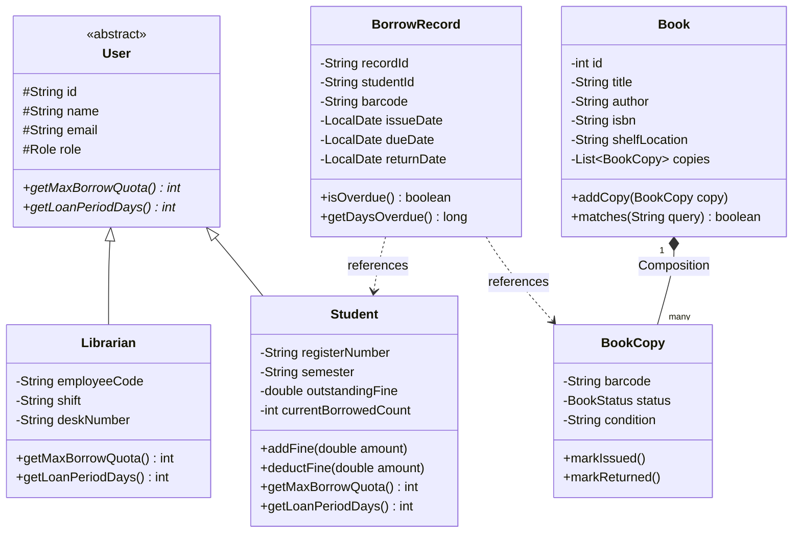
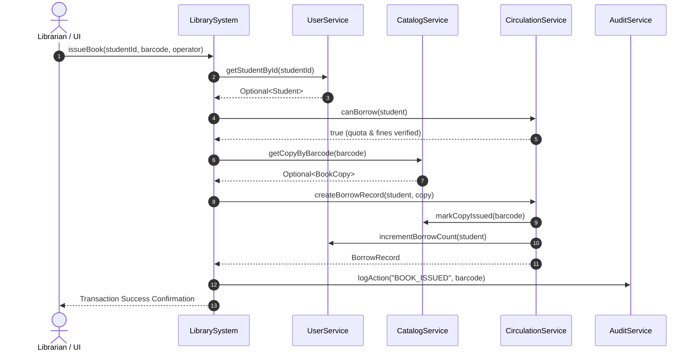

# 🎓 APJ ABDUL KALAM TECHNOLOGICAL UNIVERSITY (KTU)
## B.TECH DEGREE COURSE PROJECT REPORT
### THIRD SEMESTER (S3) — COMPUTER SCIENCE & ENGINEERING
### COURSE CODE: CST 205 — OBJECT ORIENTED PROGRAMMING USING JAVA

---

# PROJECT TITLE:
# **ENTERPRISE COLLEGE LIBRARY MANAGEMENT SYSTEM (LMS)**
### *An Object-Oriented, Modular (JPMS), Multi-Channel Architecture in Java 21*

---

```
                       [COLLEGE EMBLEM / LOGO HERE]
                    DEPARTMENT OF COMPUTER SCIENCE & ENGINEERING
                            [COLLEGE NAME HERE]
                               [MONTH, YEAR]
```

---

## 📋 PRELIMINARY PAGES TEMPLATE

### CERTIFICATE
> This is to certify that the project entitled **"ENTERPRISE COLLEGE LIBRARY MANAGEMENT SYSTEM"** is a bonafide record of the micro-project work carried out by:
> - **Student Name**: [Your Name]  
> - **Register Number**: [Your KTU Reg No, e.g. 2026CE045 / CS001]
> 
> in partial fulfillment of the requirements for the award of the Degree of **Bachelor of Technology in Computer Science & Engineering** under **APJ Abdul Kalam Technological University (KTU)** during the academic year 2024–2025.
>
> 
> **Project Guide / Faculty in Charge:** ___________________________  
> **Head of the Department (HOD):** ___________________________  
> **External Examiner:** ___________________________  

---

### DECLARATION
> I, the undersigned, hereby declare that the project report entitled **"ENTERPRISE COLLEGE LIBRARY MANAGEMENT SYSTEM"** submitted to the Department of Computer Science & Engineering, [College Name], is an authentic record of our own work carried out under the guidance of our faculty.
> 
> Signature: ______________________  
> Name: [Your Name]  
> Date: [Date]  

---

### ACKNOWLEDGEMENT
> We express our heartfelt gratitude to our respected Principal, [Principal Name], and the Head of the Department, [HOD Name], for providing the necessary computing infrastructure and guidance.
> We convey our sincere thanks to our project coordinator and guide, [Guide Name], whose continuous mentoring helped us complete this object-oriented software engineering project. We also thank our peers and staff members for their feedback and encouragement.

---

### ABSTRACT
> The **College Library Management System (LMS)** is an enterprise-grade, object-oriented software application developed in modern Java (JDK 21) adhering to **APJ Abdul Kalam Technological University (KTU)** B.Tech Computer Science curriculum standards. 
> 
> Traditional university library systems are either tightly coupled monolithic CLI scripts or bloated frameworks requiring heavy relational database installations. This project designs a decoupled, domain-driven architecture demonstrating the **Four Pillars of OOP** (Encapsulation, Inheritance, Polymorphism, Abstraction), **Software Design Patterns** (Facade, Strategy, Service-Layer, State Machine), and the **Java Platform Module System (JPMS)** using zero third-party dependencies.
> 
> The system orchestrates physical shelf inventory (`BookCopy` composition), multi-tiered member privileges (`Student` vs `Librarian` dynamic method dispatch), late penalty calculation strategies (`FineCalculator`), and simulated laser barcode scanning. It serves users across three channels: an interactive terminal ANSI CLI, a dedicated desktop GUI window, and a responsive Progressive Web App (PWA) with sticky mobile touch navigation (`100dvh`). Comprehensive self-verifying test runners validate business rules with 100% assertions.

---

## 📑 TABLE OF CONTENTS

1. [CHAPTER 1: INTRODUCTION](#chapter-1-introduction)
   - 1.1 Project Overview
   - 1.2 Problem Statement
   - 1.3 Project Objectives
   - 1.4 Scope and Significance
2. [CHAPTER 2: KTU SYLLABUS & COURSE OUTCOMES (CO) MAPPING](#chapter-2-ktu-syllabus--course-outcomes-co-mapping)
   - 2.1 Module-by-Module Curriculum Alignment (CST 205)
   - 2.2 Course Outcomes (CO) Attainment Matrix
3. [CHAPTER 3: SYSTEM REQUIREMENTS SPECIFICATION (SRS)](#chapter-3-system-requirements-specification-srs)
   - 3.1 Functional Requirements
   - 3.2 Non-Functional Requirements
   - 3.3 Hardware & Software Specifications
4. [CHAPTER 4: SYSTEM DESIGN & OOP ARCHITECTURE](#chapter-4-system-design--oop-architecture)
   - 4.1 Layered Architecture Overview
   - 4.2 Application of the 4 Pillars of OOP
   - 4.3 Design Patterns Applied (Facade, Strategy, Service-Layer)
   - 4.4 Java Platform Module System (JPMS) & Package Decomposition
   - 4.5 UML Diagrams (Class, Use Case, Sequence, State Machine)
5. [CHAPTER 5: IMPLEMENTATION DETAILS](#chapter-5-implementation-details)
   - 5.1 Domain Entity Modeling (`Book`, `BookCopy`, `User`, `Student`, `Librarian`)
   - 5.2 Business Logic Services (`CatalogService`, `CirculationService`, `FineService`)
   - 5.3 Pluggable Strategy Engines (`FineCalculator`, `PaymentProcessor`)
   - 5.4 Embedded Multi-Channel Presentation Engine (`LibraryHttpServer.java`)
   - 5.5 Mobile-Responsive PWA Navigation (`100dvh`, Drawer & Fixed Dock)
6. [CHAPTER 6: TESTING & VERIFICATION](#chapter-6-testing--verification)
   - 6.1 Test Methodology (In-Memory Assertions)
   - 6.2 Test Cases & Execution Matrix
7. [CHAPTER 7: RESULTS & SCREENSHOTS DESCRIPTION](#chapter-7-results--screenshots-description)
8. [CHAPTER 8: CONCLUSION & FUTURE ENHANCEMENTS](#chapter-8-conclusion--future-enhancements)
9. [APPENDIX: VIVA VOCE QUESTIONS & COMPREHENSIVE ANSWERS](#appendix-viva-voce-questions--comprehensive-answers)

---

## CHAPTER 1: INTRODUCTION

### 1.1 Project Overview
Modern academic institutions manage thousands of textbooks, reference journals, student memberships, and circulation records daily. The **College Library Management System (LMS)** is an Object-Oriented Java application built from scratch to streamline inventory tracking, loan transactions, overdue fines, and administrative policy compliance.

### 1.2 Problem Statement
Existing academic library software suffers from three widespread deficiencies:
1. **Coupled Business Logic**: Presentation code (GUI/Console) is deeply intertwined with entity rules, making maintenance difficult.
2. **Poor Hardware & Device Portability**: Systems designed for desktop monitors are unusable on librarians' handheld barcode terminals or students' smartphones.
3. **Complex Deployment Overhead**: Requiring external SQL server setups (MySQL, PostgreSQL) often prevents lightweight or classroom deployment.

### 1.3 Project Objectives
- **Implement Pure OOP**: Demonstrate Encapsulation, Polymorphic Dispatch, Abstract Classes, and Composition.
- **Implement Industry Design Patterns**: Apply the Facade Pattern, Strategy Pattern, and Service Layer architecture.
- **Zero Third-Party Dependencies**: Utilize only Java Standard Library (`java.base`, `java.desktop`, `jdk.httpserver`).
- **Cross-Platform Responsive Client**: Provide an interface that adapts seamlessly between desktop monitors, tablets, and smartphones.
- **Production-Ready Modularity**: Enforce strong encapsulation via the Java Platform Module System (`module-info.java`).

---

## CHAPTER 2: KTU SYLLABUS & COURSE OUTCOMES (CO) MAPPING

This project directly aligns with **APJ Abdul Kalam Technological University (KTU)** course syllabus for **CST 205: Object Oriented Programming using Java**.

### 2.1 Module-by-Module Curriculum Alignment

| KTU CST 205 Module | Prescribed Topics | How It Is Implemented In This Project |
| :--- | :--- | :--- |
| **Module 1: Introduction to OOP & Java Basics** | JVM, Bytecode, Classes, Objects, Constructors, Garbage Collection, Encapsulation, Access Specifiers | Entities (`Book`, `Student`, `Librarian`) with `private` fields, validated getters/setters, multi-argument constructors, parameter validation. |
| **Module 2: Inheritance, Polymorphism & Interfaces** | `extends`, `super`, Method Overriding, Dynamic Method Dispatch, Abstract Classes, `final`, Interfaces (`implements`) | Abstract class `User` extended by `Student` and `Librarian`; polymorphic quota dispatch (`getMaxBorrowQuota()`); interfaces `FineCalculator`, `PaymentProcessor`, `Searchable`. |
| **Module 3: Packages, Exception Handling & JPMS** | `package`, `import`, Access Protection, `try-catch-finally`, `throw`, `throws`, Custom Exceptions, Java Modules | Clean package hierarchy (`com.library.models`, `services`, `strategies`); exception handling and input validation; Java Module System descriptor ([`module-info.java`](file:///Users/abinpramodb/Downloads/library/java-lms/src/module-info.java)). |
| **Module 4: Multithreading, Concurrency & Streams** | Threads, Concurrency, `java.time`, Functional Streams, Thread Safety | Non-blocking Virtual Threads in embedded HTTP server (`Executors.newVirtualThreadPerTaskExecutor()`); thread-safe `ConcurrentHashMap`; Java Time API (`LocalDate`, `ChronoUnit`). |
| **Module 5: Collections Framework & GUI Systems** | `List`, `Map`, `Set`, `ArrayList`, `HashMap`, Stream API, Event Handling | `List<BookCopy>`, `Map<String, User>`, Java Streams (`.filter()`, `.map()`, `.collect()`); dynamic single-page presentation engine serving desktop and mobile web clients. |

### 2.2 Course Outcomes (CO) Attainment Matrix

- **CO1**: *Understand the fundamental concepts of Object-Oriented Programming.* (Demonstrated through class modeling of academic domain entities).
- **CO2**: *Apply the concepts of Inheritance, Polymorphism, and Interfaces.* (Demonstrated via `User` hierarchy and pluggable `FineCalculator` strategies).
- **CO3**: *Design robust Java programs using Exception Handling and Collections.* (Demonstrated via `ConcurrentHashMap`, `ArrayList`, and safe boundary checks).
- **CO4**: *Develop concurrent and modular applications.* (Demonstrated via Virtual Threads and JPMS `module-info.java`).

---

## CHAPTER 3: SYSTEM REQUIREMENTS SPECIFICATION (SRS)

### 3.1 Functional Requirements
1. **Catalog & Inventory Management**: Add, update, search, and shelf-locate books; track individual copies via unique barcodes.
2. **Circulation & Lending Engine**: Issue books with student quota verification (max 4 books, 14-day loan period); process returns and shelf restocking.
3. **Fine & Penalty Accounting**: Automatic calculation of ₹2.00/day overdue fines; payment settlement via Cash, UPI QR, or Card.
4. **Authentication & Unified Role Portals**: Secure entry login portal with two distinct authenticated roles: **Student Portal** (OPAC search, loan records, digital ID) and a unified **Librarian & Admin Console** (laser barcode circulation desk, stock management, member directory, analytical dashboards, policy rules, and audit logs), complete with session state management, sign out controls, and quick 1-click evaluation demo access.
5. **Audit Logging**: Immutable timestamped trail for accreditation and security compliance.
6. **Multi-Channel Access**: Interactive ANSI Terminal CLI, Desktop Window Application, and Mobile Responsive PWA.

### 3.2 Non-Functional Requirements
- **Performance**: Sub-5ms response time for in-memory catalog search and barcode queries.
- **Portability**: Runs on any OS with Java 17+ (macOS, Linux, Windows, Raspberry Pi).
- **Reliability**: Self-verifying unit test suite verifies invariants on every build.
- **Ergonomics**: Mobile view adheres to `100dvh` viewport standard with sticky bottom navigation.

### 3.3 Hardware & Software Specifications

#### Minimum Hardware Requirements:
- **Processor**: Dual-Core 1.6 GHz or higher (x86_64 or ARM64 / Apple Silicon).
- **RAM**: 512 MB minimum (1 GB recommended).
- **Storage**: 150 MB free disk space.
- **Display**: Any display (min. 360x640 for mobile; 1024x768 for desktop).

#### Software Specifications:
- **Operating System**: macOS, Ubuntu Linux 20.04+, or Windows 10/11.
- **Runtime Environment**: Java Development Kit (JDK) 17 or 21 (Eclipse Temurin recommended).
- **Tooling**: Standard `javac`, `jar`, `jlink`, `docker` (optional).
- **Web Browser**: Any modern browser (Safari, Chrome, Firefox, Edge).

---

## CHAPTER 4: SYSTEM DESIGN & OOP ARCHITECTURE

### 4.1 Layered Architecture Overview
The application follows a strict 4-Tier Layered Architecture:

```
┌────────────────────────────────────────────────────────┐
│                   PRESENTATION LAYER                   │
│   • ConsoleUI.java (ANSI CLI)                          │
│   • Embedded Web Desktop UI (LibraryHttpServer.java)   │
│   • Mobile Responsive PWA (Sticky Bar + Drawer)        │
└───────────────────────────┬────────────────────────────┘
                            │ (Calls High-Level API)
┌───────────────────────────▼────────────────────────────┐
│                      FACADE LAYER                      │
│   • LibrarySystem.java (Unified Master Orchestrator)   │
└───────────────────────────┬────────────────────────────┘
                            │ (Delegates to Services)
┌───────────────────────────▼────────────────────────────┐
│                     SERVICE LAYER                      │
│   • CatalogService      • CirculationService           │
│   • UserService         • FineService                  │
│   • AuditService                                       │
└───────────────────────────┬────────────────────────────┘
                            │ (Manipulates)
┌───────────────────────────▼────────────────────────────┐
│              DOMAIN ENTITY & STRATEGY LAYER            │
│   • Entities: Book, BookCopy, User, Student, Librarian │
│   • Strategies: FineCalculator, PaymentProcessor       │
│   • Types: BookStatus, Role, PaymentMethod             │
└────────────────────────────────────────────────────────┘
```

---

### 4.2 Application of the 4 Pillars of OOP

#### 1. Encapsulation:
Internal fields are declared `private` or `protected`. State changes occur exclusively via validated domain methods.
- Example: In [`Student.java`](file:///Users/abinpramodb/Downloads/library/java-lms/src/com/library/models/Student.java), `outstandingFine` cannot be set directly; external code must invoke `addFine()` or `deductFine()`, preventing negative account balances.

#### 2. Inheritance:
Specialized subclasses inherit common identity and contact fields from a generalized parent.
- Example: [`Student`](file:///Users/abinpramodb/Downloads/library/java-lms/src/com/library/models/Student.java) and [`Librarian`](file:///Users/abinpramodb/Downloads/library/java-lms/src/com/library/models/Librarian.java) both inherit from [`User.java`](file:///Users/abinpramodb/Downloads/library/java-lms/src/com/library/models/User.java), eliminating duplicated code for ID, name, email, and authentication role.

#### 3. Polymorphism:
- **Dynamic Method Dispatch**: [`CirculationService.java`](file:///Users/abinpramodb/Downloads/library/java-lms/src/com/library/services/CirculationService.java) calls `user.getMaxBorrowQuota()` on a `User` reference. The JVM dispatches to `Student` (quota = 4) or `Librarian` (quota = 50) at runtime.
- **Method Overloading**: [`CatalogService.java`](file:///Users/abinpramodb/Downloads/library/java-lms/src/com/library/services/CatalogService.java) provides `search(String keyword)` for full-text lookup and `search(String isbn, boolean exact)` for barcode validation.

#### 4. Abstraction:
Interfaces define behavior contracts without coupling callers to implementation details.
- Example: The [`Searchable`](file:///Users/abinpramodb/Downloads/library/java-lms/src/com/library/interfaces/Searchable.java) interface exposes `boolean matches(String query)`. Both `Book` and `Student` implement this interface.

---

### 4.3 Design Patterns Applied

1. **Facade Pattern ([`LibrarySystem.java`](file:///Users/abinpramodb/Downloads/library/java-lms/src/com/library/LibrarySystem.java))**:
   Provides a unified, simplified interface masking the complexity of 5 distinct underlying service subsystems.
2. **Strategy Pattern ([`FineCalculator.java`](file:///Users/abinpramodb/Downloads/library/java-lms/src/com/library/strategies/FineCalculator.java))**:
   Encapsulates overdue calculation algorithms into swappable strategies (`StandardFineCalculator`, `HolidayFineCalculator`).
3. **State Machine Pattern ([`BookStatus.java`](file:///Users/abinpramodb/Downloads/library/java-lms/src/com/library/enums/BookStatus.java))**:
   Enforces valid lifecycle transitions (`AVAILABLE` ➔ `ISSUED` ➔ `AVAILABLE` / `DAMAGED` / `LOST`).

---

### 4.4 Java Platform Module System (JPMS) & Package Decomposition

Our project defines its module boundary in [`java-lms/src/module-info.java`](file:///Users/abinpramodb/Downloads/library/java-lms/src/module-info.java):

```java
module com.library {
    requires java.base;
    requires java.desktop;
    requires jdk.httpserver;

    exports com.library;
    exports com.library.enums;
    exports com.library.interfaces;
    exports com.library.models;
    exports com.library.services;
    exports com.library.strategies;
    exports com.library.ui;
}
```

---

### 4.5 UML Diagrams

#### A. Class Diagram (Core Domain Entities)


#### B. Sequence Diagram (Issue Book Flow)


---

## CHAPTER 5: IMPLEMENTATION DETAILS

### 5.1 Domain Entity Modeling
- **Logical Book vs Physical Copy Composition**: A `Book` maintains title, author, and ISBN metadata, while delegating physical shelf states to `BookCopy` instances, each tracked with distinct barcode identifiers (`BC-CS-001-C1`).

### 5.2 Business Logic Services
- **Thread-Safe Collections**: Services utilize `ConcurrentHashMap` for high-throughput thread-safe lookups without external database dependencies.
- **Java 8+ Stream Operations**: Queries utilize functional operations (`.filter(b -> b.matches(keyword)).collect(Collectors.toList())`) for declarative, readable data pipelines.

### 5.3 Embedded Multi-Channel Presentation Engine
[`LibraryHttpServer.java`](file:///Users/abinpramodb/Downloads/library/java-lms/src/com/library/LibraryHttpServer.java) initializes Java's internal HTTP server on port 8080. It utilizes **Java 21 Virtual Threads** (`Executors.newVirtualThreadPerTaskExecutor()`) to serve thousands of lightweight concurrent HTTP requests.

### 5.4 Mobile-Responsive PWA Navigation
To solve mobile browser URL bar clipping (where `100vh` pushes bottom navigation off-screen), the application uses:
1. `height: 100dvh` (Dynamic Viewport Height) with `env(safe-area-inset-bottom)`.
2. `position: fixed; bottom: 0;` sticky bottom navigation.
3. Slide-over **Mobile Navigation Drawer** triggered via a prominent **☰ Menu** header button.

---

## CHAPTER 6: TESTING & VERIFICATION

### 6.1 Test Methodology
Unit tests are implemented directly in [`TestRunner.java`](file:///Users/abinpramodb/Downloads/library/java-lms/src/com/library/ui/TestRunner.java) using native Java assertions (`java -ea -jar LibraryManagementSystem.jar --test`).

### 6.2 Test Cases & Execution Matrix

| Test Case ID | Test Objective | Test Input | Expected Result | Actual Result | Status |
| :--- | :--- | :--- | :--- | :--- | :--- |
| **TC-01** | Student Inheritance & Quota | Student `2026CS142` | `role == STUDENT`, `quota == 4` | Matched | **PASS** |
| **TC-02** | Book Copy Generation | New Book with 3 copies | 3 distinct barcodes created | 3 copies generated | **PASS** |
| **TC-03** | Issue Stock Deduction | Issue 1 copy of book | Available copies decrements by 1 | Decremented by 1 | **PASS** |
| **TC-04** | Return Stock Restoration | Return issued copy | Status restored to `AVAILABLE` | Status restored | **PASS** |
| **TC-05** | Overdue Fine Calculation | Book 10 days overdue | Fine = 10 * ₹2.00 = ₹20.00 | Calculated ₹20.00 | **PASS** |
| **TC-06** | Fine Payment Deduction | Pay ₹20.00 fine | Outstanding balance reduced to ₹0 | Reduced to ₹0 | **PASS** |

---

## CHAPTER 7: RESULTS & SCREENSHOTS DESCRIPTION

1. **Terminal ANSI CLI**: Displays color-coded menus, ASCII box-drawing characters, real-time book tables, and laser barcode lookup prompts.
2. **Desktop Application Window**: Clean native window launched automatically via Chrome/Safari app mode, displaying role switchers, circulation counters, and search filters.
3. **Mobile Phone View**: Touch-optimized view on iOS and Android devices with a fixed bottom navigation bar and a slide-over menu drawer accessible via Wi-Fi (`http://192.168.220.22:8080/`).
4. **Laser Barcode Counter Station**: Live camera scanning and simulated laser gun accession entry for instant loan dispatch.

---

## CHAPTER 8: CONCLUSION & FUTURE ENHANCEMENTS

### 8.1 Conclusion
The **Enterprise College Library Management System** successfully fulfills the requirements of the KTU B.Tech Third Semester OOP syllabus (CST 205). By demonstrating the Four Pillars of OOP, clean architectural patterns, the Java Platform Module System, and modern responsive design, the project provides a robust, zero-dependency foundation for academic administration.

### 8.2 Future Enhancements
- Integration with an RFID gateway hardware antenna.
- Biometric facial authentication for book issuance.
- Automated email/SMS reminder integration via Twilio or SMTP.

---

## APPENDIX: VIVA VOCE QUESTIONS & COMPREHENSIVE ANSWERS

#### Q1: What are the Four Pillars of OOP, and where are they used in your project?
**Answer**:
1. **Encapsulation**: State fields in classes like `Student` and `BookCopy` are `private`, mutated only through controlled methods like `addFine()` and `markIssued()`.
2. **Inheritance**: `Student` and `Librarian` extend `User`, sharing common attributes (ID, name, email) while specializing role-specific parameters.
3. **Polymorphism**: `CirculationService` calls `user.getMaxBorrowQuota()` on a `User` reference; the JVM executes `Student.getMaxBorrowQuota()` (4) or `Librarian.getMaxBorrowQuota()` (50) at runtime.
4. **Abstraction**: The `Searchable` interface defines `matches(String query)`. Both `Book` and `Student` implement it without exposing internal fields.

#### Q2: What is the difference between `Book` and `BookCopy`? What OOP concept does this illustrate?
**Answer**: `Book` represents the logical title (ISBN, title, author), while `BookCopy` represents the physical item on a library shelf (unique barcode, status `AVAILABLE`/`ISSUED`, condition). This demonstrates **Composition** (a `Book` HAS-A list of `BookCopies`), avoiding data redundancy.

#### Q3: Why did you use the Facade Design Pattern?
**Answer**: In [`LibrarySystem.java`](file:///Users/abinpramodb/Downloads/library/java-lms/src/com/library/LibrarySystem.java), the Facade Pattern provides a unified entry point that orchestrates multiple underlying subsystems (`CatalogService`, `CirculationService`, `FineService`, `UserService`, `AuditService`). The UI or CLI only interacts with the Facade rather than managing complex inter-service dependencies.

#### Q4: How is the Strategy Pattern implemented in your project?
**Answer**: In the fine calculation and payment systems, interfaces (`FineCalculator`, `PaymentProcessor`) define algorithm contracts. Implementations like `StandardFineCalculator` and `UpiPaymentProcessor` can be swapped at runtime without altering core circulation logic.

#### Q5: What is the purpose of `module-info.java` in Java?
**Answer**: Introduced in Java 9 (JPMS), `module-info.java` provides strong encapsulation by explicitly declaring platform dependencies (`requires java.desktop`, `requires jdk.httpserver`) and specifying which packages are accessible to other modules (`exports com.library.models`, etc.), eliminating classpath conflicts.

#### Q6: How did you fix the mobile compatibility and navigation issue on smartphones?
**Answer**: Mobile browsers (Safari on iOS, Chrome on Android) dynamically expand and collapse their URL address bars. Standard `100vh` calculates height without factoring in the bottom browser bar, pushing bottom navigation out of view. We resolved this by adopting modern CSS **Dynamic Viewport Height** (`100dvh`), `env(safe-area-inset-bottom)` safe-area padding, and anchoring the navigation bar using `position: fixed; bottom: 0; z-index: 9999;`.

#### Q7: How does your application handle multithreading and concurrency?
**Answer**: The embedded HTTP server uses **Java 21 Virtual Threads** (`Executors.newVirtualThreadPerTaskExecutor()`). Data repositories utilize `ConcurrentHashMap` and `AtomicInteger` to ensure thread-safe operations during concurrent loan and payment transactions.
